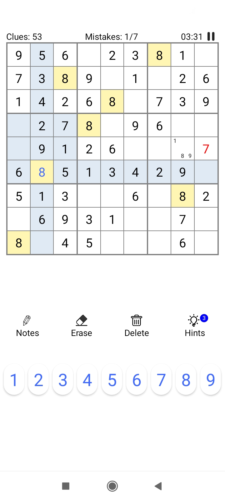
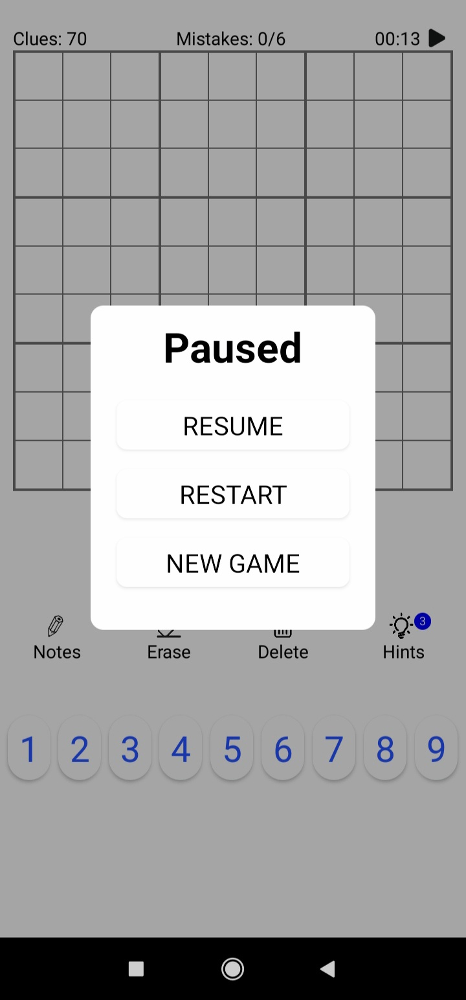

# Sudoku – Android App

A simple Sudoku game built as a learning project while exploring Android app development.
This project focuses on core Android concepts such as activities, layouts, event handling, and basic game logic.

The app is not actively maintained and mainly exists as a record of earlier learning work.

---

## Features

* Play classic Sudoku puzzles
* Interactive grid with number input
* Basic game validation
* Simple and lightweight UI

---

## Screenshots

<p align="center">
  
  
  
</p>

---

## Tech Stack

* **Language:** Java
* **Platform:** Android
* **Build System:** Gradle
* **Android Gradle Plugin:** 4.1.x
* **Minimum SDK:** (see `app/build.gradle`)

---

## Project Status

This is a **legacy learning project**.

* Originally developed around **2020–2021**
* Original file timestamps and build metadata were lost
* The available APK was re-signed in **April 2022**

The project is shared for reference and learning purposes rather than production use.

---

## Building the Project

1. Clone the repository:

   ```bash
   git clone https://github.com/lightningbat/sudoku.git
   ```
2. Open the project in **Android Studio**
3. Let Gradle sync
4. Run the app on an emulator or physical device
